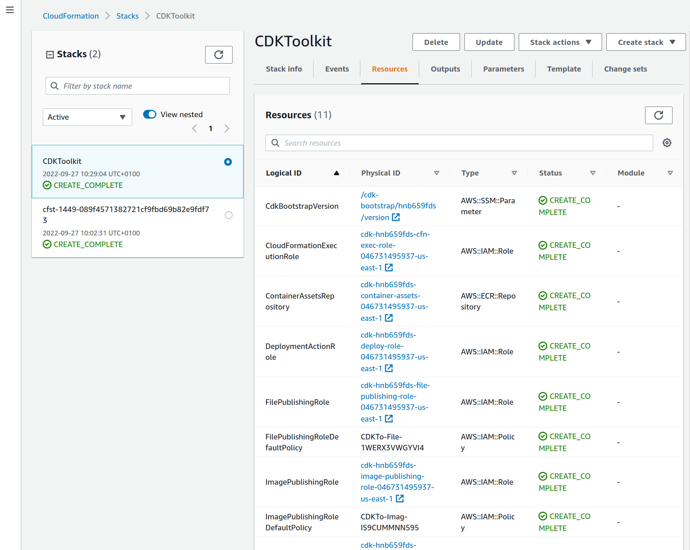
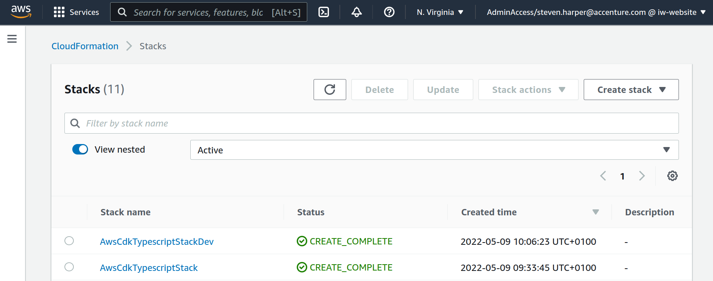
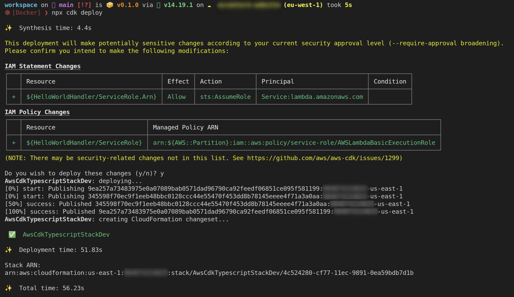
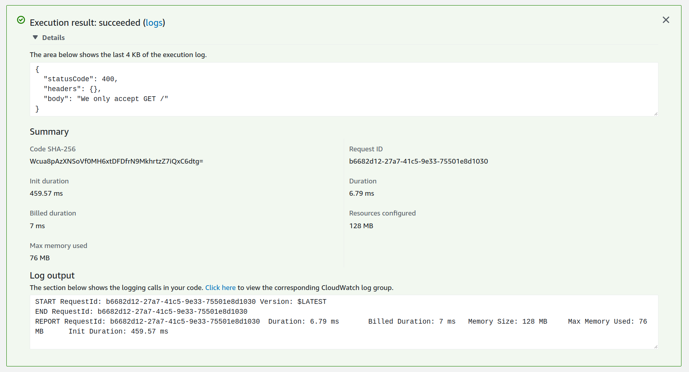

# 101 AWS CDK TypeScript - Infinity Works

This is the 101 on AWS CDK written in TypeScript, it will introduce you to AWS CDK and some of the features.

CDK allows you to control infrastructure as code in AWS, it allows you to do this in many supported languages. In this session we will be using TypeScript.

CDK Generates CloudFormation, that is then pushed out as stacks in the targetted AWS Account.

AWS keep the CDK up-to-date with latest new products and features, it is a first class citizen in the AWS ecosystem.

## Prerequisites

You'll need an AWS account to deploy your resources to. This 101 Session won't use anything that doesn't fit in the free tier of usage, so you shouldn't expect a large AWS bill or anything.

This session ships with a VS Code Dev Container which contains all prerequisites. This requires Docker, and VS Code.

* Docker Desktop - <https://www.docker.com/products/docker-desktop/>
* VS Code - <https://code.visualstudio.com/download>

However, if you prefer to run directly on your machine, you'll need to have:

* Node.js - <https://nodejs.org/en/download/>
* AWS CDK - Run `npm install -g aws-cdk` after the Node.js install completes
* AWS CLI - <https://aws.amazon.com/cli/>

## Outline

* How to setup a new project
* Step 1 - Build the project
* Step 2 - Authenticate into AWS and run CDK Bootstrap
* Step 3 - Deploy the Stack into AWS
* Step 4 - Improve config and multi environments
* Step 5 - Pass configuration into the stack
* Step 6 - Deploy a lambda
* Step 7 - Give the Lambda access to a DynamoDB table
* Step 8 - Clean up

## How to setup a new project

There is a provided `VSCode Dev Container` that allows you to run the whole environment in `Docker`.

The versions in this are:

* node v18.9.1
* npm v8.19.1
* awscli v2.7.7
* Python v.3.9.11

### Log in to the AWS CLI

If you're using an organisation's account that uses AWS SSO, follow their instructions.

Otherwise, you might find the AWS documentation helpful: <https://docs.aws.amazon.com/cli/latest/userguide/cli-configure-quickstart.html>

The following command will print out your user name once you've logged in:

```shell
aws sts get-caller-identity
```

## How to start

See [STARTING.md](STARTING.md) to see how to start a fresh CDK project.

## Step 1 - Build the project

```shell
npm ci
export AWS_ENVIRONMENT=DEVELOPMENT
export STACK_SUFFIX=YOURSUFFIX
npx cdk synth
```

## Intro

### CDK starting point

The entry point is configured in the [package.json](package.json) file.

Here we can see that the entrypoint will be `bin/aws-cdk-typescript.js`

```json
{
  "name": "aws-cdk-typescript",
  "version": "1.0.0",
  "bin": {
    "101-aws-cdk-typescript": "bin/aws-cdk-typescript.js"
  },
```

### Environment config and Stack

The starting minimal file in [bin/aws-cdk-typescript.ts](bin/aws-cdk-typescript.ts) looks for the system environment `AWS_ENVIRONMENT` it expects one of three values

* DEVELOPMENT
* TESTING
* PRODUCTION

These environments are designed to be dropped into specific `aws accounts` the expected account number is configured in the file [lib/aws-environments.ts](lib/aws-environments.ts).

> Update your Account numbers here now.

We plan to allow everyone to deploy this same application into a single AWS Account, to make this possible we will supply a system environment `STACK_SUFFIX` which will be used to make the Stack name unique.

A CDK project can make multiple stacks, in this example we start with a single `CloudFront Stack` called `AwsCdkTypescriptStack-YOURSUFFIX`.

If you look at the lib file [lib/aws-cdk-typescript-empty-stack.ts](lib/aws-cdk-typescript-empty-stack.ts) you can see that this will be an empty stack.

```ts
import { Stack, StackProps } from 'aws-cdk-lib'
import { Construct } from 'constructs'

export class AwsCdkTypescriptStack extends Stack {
    constructor(scope: Construct, id: string, props?: StackProps) {
        super(scope, id, props)
    }
}
```

## Step 2 - Authenticate into AWS and run CDK Bootstrap

For this step you will need to setup your `AWS CLI` profile using whatever mechanism you have chosen to authenticate.

You should be-able to export a `profile` and then use the standard AWS CLI to make api calls into your AWS Account.

> This is normally configured in a file in your home directory `~/.aws/config`

```shell
export AWS_PROFILE=name-of-your-profile
aws sts get-caller-identity
```

If this works, you should see the `AWS Role` that is active.

We can now run the CDK Bootstrap, which creates a CloudFormation stack that is required by CDK.

```shell
export AWS_ENVIRONMENT=DEVELOPMENT
export STACK_SUFFIX=YOURSUFFIX
npx cdk bootstrap
```

Now in the `AWS Console` in the `N.Virginia` region you should see the new Stack `CDKToolkit`

<https://us-east-1.console.aws.amazon.com/cloudformation/home?region=us-east-1#/stacks>



## Step 3 - Deploy the Stack into AWS

Change the `AWS_ENV_DEV` variable in the `./lib/aws-environments.ts` file so that the value is the account ID of the AWS account that you want to use.

You can get the account ID of the AWS account you're currently logged into by using the following command:

```shell
aws sts get-caller-identity
```

We can now deploy the empty stack with:

```shell
export AWS_ENVIRONMENT=DEVELOPMENT
export STACK_SUFFIX=YOURSUFFIX
npx cdk deploy
```

> Tip : You can use the `--rollback=false` to prevent auto rollback in Cloud Formation

Now in the `AWS Console` in the `N.Virginia` region you should see the new Stack `AwsCdkTypescriptStack`

<https://us-east-1.console.aws.amazon.com/cloudformation/home?region=us-east-1#/stacks>


## Step 4 - Improve config and multi environments

We are now going to make the example more useful.

We will enable the different environments to be deployed into a single AWS Account (if required).

We will also add a mechanism for un-secured configuration.

Copy the contents of the [examples/1_config_aws-cdk-typescript.ts](examples/1_config_aws-cdk-typescript.ts) file into [bin/aws-cdk-typescript.ts](bin/aws-cdk-typescript.ts)

The changes in here enable an environment to have a more complex config.

```ts
export interface AppConfig {
    awsAccountNumber: string
    mainRegion: string
    environmentName: string
}
```

The stack name is now `Dynamic` depending on the Environment Name.

```ts
new AwsCdkTypescriptStack(app, `AwsCdkTypescriptStack${currentConfig.environmentName}-${process.env.STACK_SUFFIX}`, {
    env: { account: currentConfig.awsAccountNumber, region: currentConfig.mainRegion },
})
```

Lets deploy these changes; this will make a new stack called `AwsCdkTypescriptStackDev-YOURSUFFIX`

```shell
export AWS_ENVIRONMENT=DEVELOPMENT
export STACK_SUFFIX=YOURSUFFIX
npx cdk deploy
```



Now lets delete the first stack we made called `AwsCdkTypescriptStack` in the `AWS Console`

## Step 5 - Pass configuration into the stack

Now we are going to pass this config into the stack.

Copy the contents of the [examples/2_pass_config_aws-cdk-typescript.ts](examples/2_pass_config_aws-cdk-typescript.ts) file into [bin/aws-cdk-typescript.ts](bin/aws-cdk-typescript.ts)

This stack uses a different `lib` file [lib/aws-cdk-typescript-config-stack.ts](lib/aws-cdk-typescript-config-stack.ts)

In this is the code for a custom `StackProps`, this allows us to define what configuration this stack requires.

```ts
export interface CustomStackProps extends StackProps {
    environmentName: string
}

export class AwsCdkTypescriptStack extends Stack {
    constructor(scope: Construct, id: string, props: CustomStackProps) {
        super(scope, id, props)
    }
}
```

So the props that are passed in to the stack need to match the shape of this new custom interface:

```ts
new AwsCdkTypescriptStack(app, `AwsCdkTypescriptStack${currentConfig.environmentName}-${process.env.STACK_SUFFIX}`, {
    env: { account: currentConfig.awsAccountNumber, region: currentConfig.mainRegion },
    environmentName: currentConfig.environmentName,
})
```

Lets deploy these changes:

```shell
export AWS_ENVIRONMENT=DEVELOPMENT
export STACK_SUFFIX=YOURSUFFIX
npx cdk deploy
```

This results in `no changes` (which is good)


## Step 6 - Deploy a lambda

This step will add an `AWS Lambda` function to the stack.

Copy the contents of the [examples/3_add_lambda_aws-cdk-typescript.ts](examples/3_add_lambda_aws-cdk-typescript.ts) file into [bin/aws-cdk-typescript.ts](bin/aws-cdk-typescript.ts)

We can se now that this uses the new [lib/aws-cdk-typescript-lambda-stack.ts](lib/aws-cdk-typescript-lambda-stack.ts).

This code creates a `Lambda` and exposes it using the `Lambda URL` feature.

```ts
const helloWorld = new NodejsFunction(this, 'HelloWorldHandler', {
    runtime: Runtime.NODEJS_16_X,
    entry: join(__dirname, '../', 'lambdas', 'hello-world.ts'),
    memorySize: 1024,
    environment: {
        ENV_NAME: props.environmentName,
    }
})

const helloWorldUrl = helloWorld.addFunctionUrl({ authType: FunctionUrlAuthType.NONE })
new CfnOutput(this, 'Url', { value: helloWorldUrl.url })
```

CDK builds the lambda from the code in the file [lambdas/hello-world.ts](lambda/hello-world.ts).

This is done using `esbuild`. In the main [package.json](package.json) the `postinstall` script pulls the node_modules down when the main `install` task runs:

```json
  "scripts": {
    "postinstall": "(cd lambdas && npm install);",
    "cdk": "cdk"
  },
```

The CDK passes the Environment name into the Lambda Function as an Environment Variable.

The code can collect the value and use it to dynamically create a message.

> note that the Lambda code is using the `AWS SDK` not the `AWS CDK`

With API Gateway V2, if a Lambda function returns a JavaScript object that doesn't have a `statusCode` key, it's returned as a JSON string, with HTTP status code of 200.

So code that looks like this:

```ts
var body = {
    message: `hello ${sourceIp} from ${environmentName}`
}
return {
    statusCode: 200,
    headers: {},
    body: JSON.stringify(body)
}
```

Can be simplified to:

```ts
return {
    message: `hello ${sourceIp} from ${environmentName}`
}
```

Finally we also output the `Function URL` as a cloudformation output:

```ts
new CfnOutput(this, 'Url', { value: helloWorldUrl.url })
```

Lets deploy these changes:

```shell
export AWS_ENVIRONMENT=DEVELOPMENT
export STACK_SUFFIX=YOURSUFFIX
npx cdk deploy
```

> Note you will get asked about some roles that will get created as part of your requested changes



We can see that the newly created Lambda is automatically named after the stack it is in, with some random characters as a suffix
`AwsCdkTypescriptStackDev-HelloWorldHandler30C22324-YxT5RINWVqyW`

If we test this lambda using the lambda test in the AWS Console we get the expected `400 response`



When we hit the URL in a browser we get a nice 200 response (with a JSON payload)

```json
{"message":"hello 109.180.183.211 from Dev"}
```

You can also use the `VSCODE extension` called `humao.rest-client` to make http requests, see [test.http](test.http)

The dynamic parts of the response have been pulled from the `event` object, here is an example event payload:

```json
{
    "version": "2.0",
    "routeKey": "$default",
    "rawPath": "/",
    "rawQueryString": "",
    "headers": {
        "sec-fetch-mode": "navigate",
        "sec-fetch-site": "none",
        "accept-language": "en-GB,en-US;q=0.9,en;q=0.8",
        "x-forwarded-proto": "https",
        "x-forwarded-port": "443",
        "x-forwarded-for": "109.180.183.219",
        "sec-fetch-user": "?1",
        "accept": "text/html,application/xhtml+xml,application/xml;q=0.9,image/avif,image/webp,image/apng,*/*;q=0.8,application/signed-exchange;v=b3;q=0.9",
        "sec-ch-ua": "\" Not A;Brand\";v=\"99\", \"Chromium\";v=\"101\", \"Google Chrome\";v=\"101\"",
        "sec-ch-ua-mobile": "?0",
        "x-amzn-trace-id": "Root=1-62790940-791d9c4f64628ce840aa9da1",
        "sec-ch-ua-platform": "\"Linux\"",
        "host": "gz35gityuve3my64zwqypdfznq0bcuwk.lambda-url.us-east-1.on.aws",
        "upgrade-insecure-requests": "1",
        "cache-control": "max-age=0",
        "accept-encoding": "gzip, deflate, br",
        "sec-fetch-dest": "document",
        "user-agent": "Mozilla/5.0 (X11; Linux x86_64) AppleWebKit/537.36 (KHTML, like Gecko) Chrome/101.0.4951.54 Safari/537.36"
    },
    "requestContext": {
        "accountId": "anonymous",
        "apiId": "gz35gityuve3my64zwqypdfznq0bcuwk",
        "domainName": "gz35gityuve3my64zwqypdfznq0bcuwk.lambda-url.us-east-1.on.aws",
        "domainPrefix": "gz35gityuve3my64zwqypdfznq0bcuwk",
        "http": {
            "method": "GET",
            "path": "/",
            "protocol": "HTTP/1.1",
            "sourceIp": "109.180.183.211",
            "userAgent": "Mozilla/5.0 (X11; Linux x86_64) AppleWebKit/537.36 (KHTML, like Gecko) Chrome/101.0.4951.54 Safari/537.36"
        },
        "requestId": "d382c483-bfff-4f29-9094-7d6e1a427b19",
        "routeKey": "$default",
        "stage": "$default",
        "time": "09/May/2022:12:29:52 +0000",
        "timeEpoch": 1652099392316
    },
    "isBase64Encoded": false
}
```

## Step 7 - Give the Lambda access to a DynamoDB table

In this step we will add a `DynamoDB table` and grant the lambda access to write to it.

CDK makes this very simple, and deals with a lot of the complexity under the hood.

Copy the contents of the [examples/4_add_dynamo_aws-cdk-typescript.ts](examples/4_add_dynamo_aws-cdk-typescript.ts) file into [bin/aws-cdk-typescript.ts](bin/aws-cdk-typescript.ts)

The new lib is [lib/aws-cdk-typescript-lambda-dynamo-stack.ts](lib/aws-cdk-typescript-lambda-dynamo-stack.ts); in this file we can now see that we create a DynamoDB table:

```ts
const table = new Table(this, 'Store', {
    billingMode: BillingMode.PAY_PER_REQUEST,
    removalPolicy: RemovalPolicy.DESTROY,
    partitionKey: {
        name: 'id',
        type: AttributeType.STRING,
    },
    sortKey: {
        name: 'ipAddress',
        type: AttributeType.STRING,
    },
    pointInTimeRecovery: true,
})
```

We pass the `table name` to the lambda as an environment variable named `STORE_TABLE_NAME`:

```ts
environment: {
    ENV_NAME : props.environmentName,
    STORE_TABLE_NAME : table.tableName,
}
```

New Lambda function code is being used to integrate with DynamoDB: [lambdas/hello-world-store.ts](lambdas/hello-world-store.ts).

```ts
entry: join(__dirname, '../', 'lambdas', 'hello-world-store.ts'),
```

In this script, when a `POST` is received, it writes a new entry with the requestor's IpAddress into the table:

```ts
const params = {
    TableName : storeTableName,
    Item: {
        id: `${uuidv4()}`,
        ipAddress: `${sourceIp}`
    }
}
await docClient.put(params).promise()
```

In CDK, resources have helper functions on them to use to assign access.

In our case, we need to give the Lambda function write access to the table, so we use the table's `grantWriteData` method and pass it the `helloWorld` Lambda Function.

CDK then updates the IAM role assigned to the Lambda Function to give it the appropriate permissions to write (not read) to the table. This simplifies working with IAM for many use cases.

```ts
table.grantWriteData(helloWorld)
```

Lets deploy these changes:

```shell
export AWS_ENVIRONMENT=DEVELOPMENT
export STACK_SUFFIX=YOURSUFFIX
npx cdk deploy
```

During deployment you will be prompted to approve changes to IAM roles (permissions).


Now we can use the POST example to make the http requests, see [test.http](test.http)

```json
HTTP/1.1 200 OK
Date: Tue, 10 May 2022 12:35:56 GMT
Content-Type: application/json
Content-Length: 92
Connection: close
x-amzn-RequestId: 16743714-3595-4105-b0ee-fd69403c856f
X-Amzn-Trace-Id: root=1-627a5c2b-258ba70a668b14354c7f4aa3;sampled=0

{
  "message": "Stored 109.180.183.219 in AwsCdkTypescriptStackDev-Store1D2A845B-1V2E2S34D0Y6F"
}
```

We can see the new entries appearing in the database using the AWS Console <https://us-east-1.console.aws.amazon.com/dynamodbv2/home?region=us-east-1#tables>


## Step 8 - Clean up

Lets destroy the stack:

```shell
export AWS_ENVIRONMENT=DEVELOPMENT
export STACK_SUFFIX=YOURSUFFIX
npx cdk destroy
```
