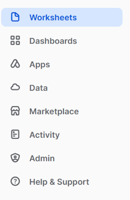

# A quick tour of the UI

## The main menu

The top menu allows you to switch between the different areas of Snowflake.

Areas:
* Databases
* Shares
* Data Marketplace
* Warehouses
* Worksheets
* History
* Account

## Databases

Shows information about the databases you have created or have privileges to access. You can create, clone, drop, or transfer ownership of databases as well as load data (limited) in the UI.

## Shares

Allows data sharing to be configured to easily and securely share Snowflake table(s) among separate Snowflake accounts or external users.

## Data Marketplace

Allows you to import pre-made data sets curated by external companies.

## Warehouse

This is where you set up and manage compute resources (virtual warehouses) to load or query data in Snowflake.

## Worksheets

Provides an interface for submitting SQL queries, performing DDL and DML operations and viewing results as your queries/operations complete.

Each worksheet has it's own "context" which defines which role, warehouse, database, and schema your queries will be run inside. This allows you to have multiple worksheets simultaneously with different config. This differs from the account context (top right) which determines which items appear in the top menu and what function you are allowed to run in the UI outside of the worksheet context.

Worksheets are saved automatically each time you change the content and will be persisted in your account until you explicily remove them.

## History

Allows you to view the details of all queries executed in the last 14 days in the Snowflake account.

## Account

The account area allows you to manage/monitor billing and resource usage as well as create users and roles. This is only visible when you are using the `ACCOUNTADMIN` role.
