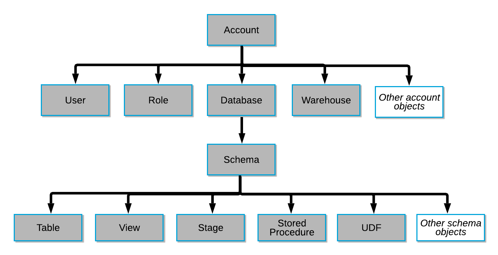

# Creating resources

You can either use worksheets in the GUI or execute SQL commands with the CLI tool SnowSQL, which we will come on to later.

## Resources overview

## Creating users [[docs](https://docs.snowflake.com/en/sql-reference/sql/create-user.html)]

A 'user' is user identity recognised by Snowflake, whether associated with a real person or program.

In a new worksheet, try running:

    USE ROLE SECURITYADMIN;

This will change the role for your _current worksheet_ only.

Now we have adopted the security admin role, we can create users and roles.

    CREATE USER IF NOT EXISTS JohnnyLawrence password='superSecretPass' default_role = PUBLIC must_change_password = true;

The Snowflake docs will provide a list of all arguments you can pass during user creation, for example including a user's email address, though the above is enough to get started.

## Create roles [[docs](https://docs.snowflake.com/en/sql-reference/sql/create-role.html)]

Snowflake uses roles to control the objects (virtual warehouses, databases, tables, etc.) that users can access:
* Snowflake provides a set of predefined roles, as well as a framework for defining a hierarchy of custom roles.
* All Snowflake users are automatically assigned the predefined PUBLIC role, which enables login to Snowflake and basic object access.
* In addition to the PUBLIC role, each user can be assigned additional roles, with one of these roles designated as their default role. A user’s default role determines the role used in the Snowflake sessions initiated by the user; however, this is only a default. Users can change roles within a session at any time.
* Roles can be assigned at user creation or afterwards.

    CREATE ROLE IF NOT EXISTS DATA_CONSUMER COMMENT = 'Role to access raw data';

Take a look at all the system users and roles created so far:

List users:

    SHOW USERS;

List roles:

    SHOW ROLES;

> **IMPORTANT NOTE:** Objects are not case sensitive unless "quoted". See [Identifier Requirements](https://docs.snowflake.com/en/sql-reference/identifiers-syntax.html) for more info around case sensitivity and allowed characters in Snowflake

### Assigning a role to a user

    GRANT ROLE DATA_CONSUMER TO USER JohnnyLawrence

## Create databases [[docs](https://docs.snowflake.com/en/sql-reference/sql/create-database.html)]

To instantiate resources like databases, you must adopt the `SYSADMIN` role:

    USE ROLE SYSADMIN;
    CREATE DATABASE RAW_DATA;

To enable roles to access the database we must grant permissions:

    GRANT USAGE, CREATE SCHEMA ON DATABASE RAW_DATA TO DATA_CONSUMER;

## Create schemas [[docs](https://docs.snowflake.com/en/sql-reference/sql/create-schema.html)]

    USE DATABASE RAW_DATA;
    CREATE SCHEMA SALES;

## Create tables [[docs](https://docs.snowflake.com/en/sql-reference/sql/create-table.html)]

The format to create tables is:

    CREATE TABLE db_name.schame_name.table_name (col_1_name col_1_data_type, col_2_name col_1_data_type)

### Data Types [[docs](https://docs.snowflake.com/en/sql-reference/intro-summary-data-types.html)]

Snowflake supports most of the standard data types (strings, numbers, booleans, dates) as well as the VARIANT data type for semi-structured data and the GEOGRAPHY data type for geospatial data: [docs](https://docs.snowflake.com/en/sql-reference/intro-summary-data-types.html)

We will consume JSON data and so choose a single column of the Snowflake's special VARIANT type which allows importing and querying of semi-structured data.

    CREATE TABLE RAW_DATA.SALES.TRANSACTIONS (RAW_DATA VARIANT);
