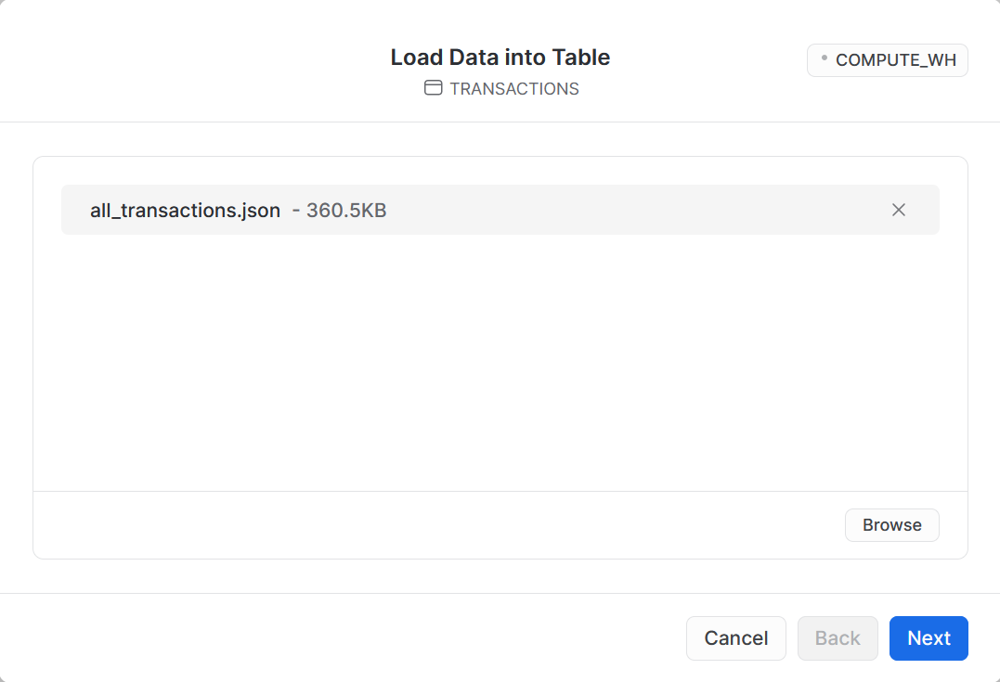
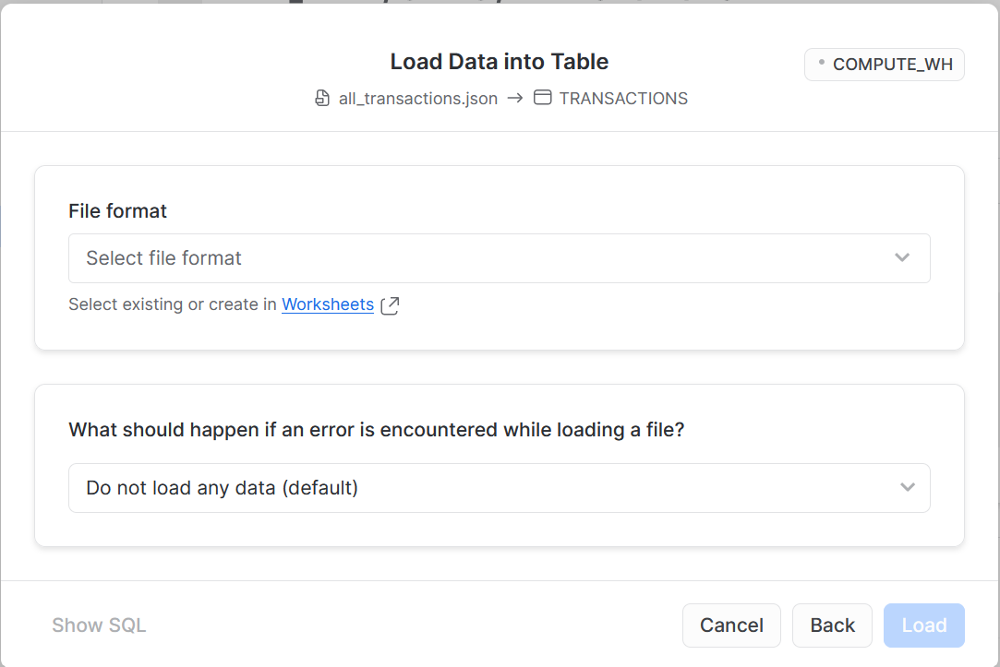
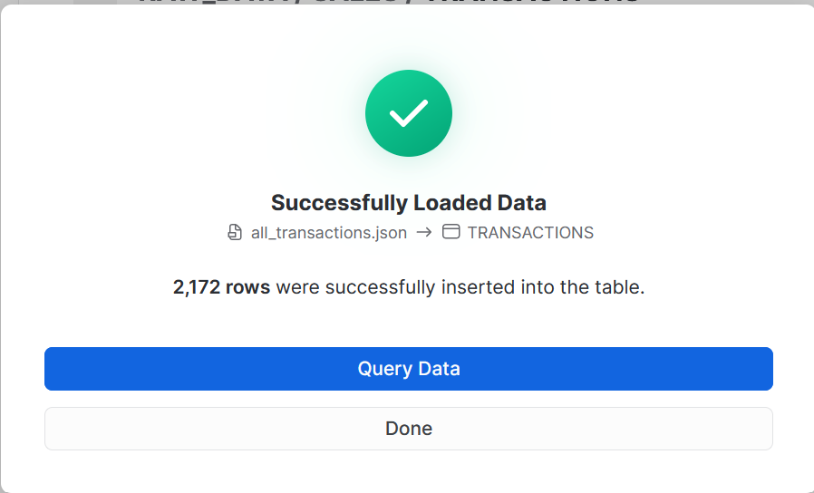

# Loading data via the Snowflake UI [[docs](https://docs.snowflake.com/en/user-guide/data-load-web-ui.html)]

## The Snowflake Load Data Wizard

To load ad-hoc files into Snowflake, we can use the Snowflake Load Data Wizard which is part of the Snowflake UI. In the _real world_, you would usually build a data pipeline to automate this but the Load Data Wizard is a great way to easily import data while you are developing and testing new functionality for your data warehouse.

To load data into the transactions table, we can use Snowflake's built-in table stage. A stage is a temporary holding area for data which we'll use to load our files into Snowflake. We don't need to dive too deep into stages at this stage but for the curious, further reading can be found [here](https://docs.snowflake.com/en/user-guide/data-load-local-file-system-create-stage.html).

## Getting the data

Sample transaction data has been provided in a public S3 bucket `snowflake-101` based on shopping baskets for a supermarket.

### Transactions files

To download the files, you have a couple of options:

1. Via your web browser:

    Visit <https://snowflake-101.s3.eu-west-1.amazonaws.com/all_transactions.json> and save the file/page to your local disk.

1. In your **terminal** using `curl`. **NOTE: Do not run this in your Snowflake worksheet**

        curl https://snowflake-101.s3.eu-west-1.amazonaws.com/all_transactions.json > all_transactions.json

## Loading data via the console UI

To load data via the console, navigate to the Data tab of the main menu. If you're in a worksheet, you will need to click the `< Worksheets` button in the top-left to get back ot the main menu.

### Use the tree view to navigate to the table you wish to upload data into

### Click on Load Data in the top right

You'll now be taken through a series of options to choose the file you're loading, and its file format.

### Select your warehouse

The `COMPUTE_WH` warehouse has been automatically selected. This is correct for this example, but if you ever need to change to a different warehouse, you can do that in the top-right of the window.

### Choose your files to upload

Either drag and drop the `all_transactions.json` file onto this window, or click the `Browse` button to select it.

Click `Next`

At this point you must choose a `FILE FORMAT` which defines your data;

## File formats [[docs](https://docs.snowflake.com/en/sql-reference/sql/show-file-formats.html)]

File formats are used to define custom data structures, whether that be unstructured JSON or relational CSV data; they instruct Snowflake how to read and handle the data you wish to upload. File formats belong to a database and schema. A file format can receive instructions including if the file is compressed or not, the encoding, whether the CSV file has a header row (column names), and how Snowflake handles errors when it receives bad data.

Let's continue with the wizard. Our data is JSON so select the `File format` as JSON .

There are several options which allow you to control how the data is loaded, but for this example we can just use the defaults. Note the very bottom option which lets you control what happens if there's an error. You may wish to fail the whole file and load no data (this is the default behaviour), or load the valid data from the file and discard the invalid data.

Click `Load` to load the data into your `TRANSACTIONS` table.

You can now click the `Query Data` button which will open a new worksheet, run the query and you can see the data which has been loaded. If you clock on one of the lines in the results, you'll see the JSON for that line on the right, this is usuallyt easier to read than looking directly at the results

