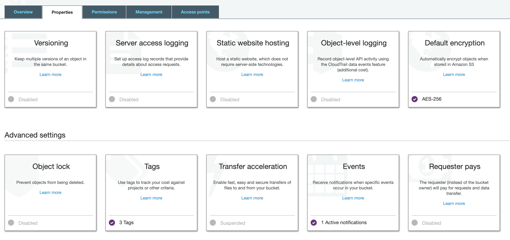
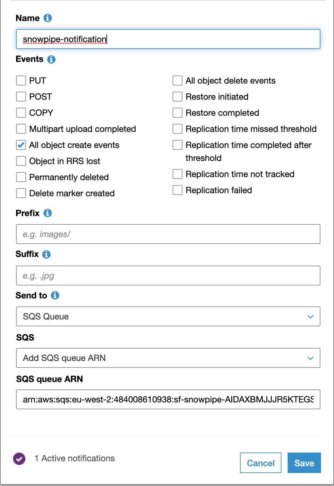
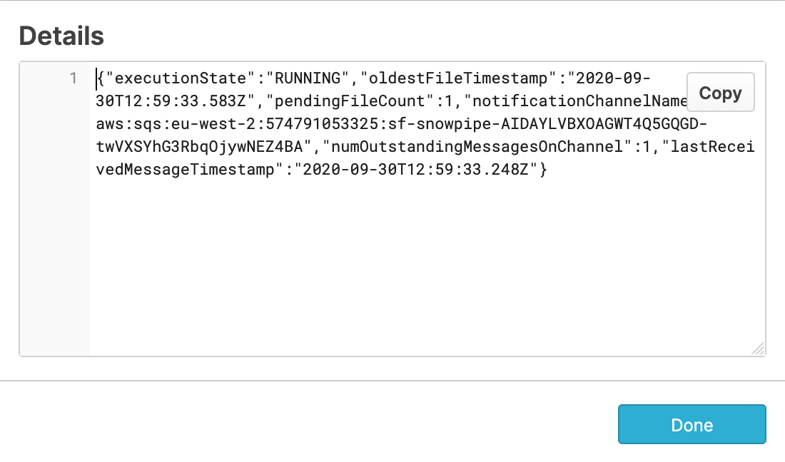

# Automating data ingestion from S3 with snowpipes [[docs](https://docs.snowflake.com/en/sql-reference/sql/create-pipe.html)]

A snowpipe is an event driven resource which automates data ingestion from cloud storage. When a pipe is created, Snowflake also creates and manages an SQS resource, which is configured for when a file lands in our s3 bucket - an event notification is published to this queue; the snowpipe polls the queue for metadata to consume new files.

To automate data consumption from s3 [[docs](https://docs.snowflake.com/en/user-guide/data-load-snowpipe-auto-s3.html)], we will need the following:

- Landing table
- IAM role
- Account integration
- External Stage
- Snowpipe
- s3 bucket notification

Since our stage and storage integration were created with the ACCOUNTADMIN role, we'll need to adopt that role to use them in pipe creation:

    use role ACCOUNTADMIN;

Configure the database and schema:

    USE DATABASE RAW_DATA;
    USE SCHEMA SALES;

Confirm we have a valid stage:

    show stages;

Create the snowpipe:

    create pipe S3_PIPE
        auto_ingest = true
        as
        copy into "RAW_DATA"."SALES"."TRANSACTIONS"
        from @S3_EXTERNAL_STAGE
        file_format = (type = 'JSON');

With the pipe now instantiated we must configure an event notification on our chosen s3 bucket. Grab the Snowflake SQS ARN for the pipe, `notification_channel` from:

    DESC pipe S3_PIPE;

Truncate the table before our data load:

    TRUNCATE TABLE RAW_DATA.SALES.TRANSACTIONS;

Return to the AWS console and enter the settings of your s3 bucket and select `Events`:

Here we can `add notification` to publish to Snowflake's SQS arn when a new file lands in the bucket.

- Give it an appropriate name
- Select `All object create events`
- Add any file meta data you wish to filter by (for now leave this empty).
- Send to: `SQS Queue`
- `Add Queue ARN`
- Save

This should now be configured for all files landing into the bucket to be consumed by the pipe.

## Pipe status

We can test the system by using the AWS CLI to push data into S3 and watch it be consumed in Snowflake. This time, we will load individual json files, rather than an aggregate file.

To aquire this, use the AWS CLI; note you will need a valid AWS session.

    aws s3 cp --recursive s3://snowflake-101/transactions/ transactions/   

To push this to your bucket:

    aws s3 cp --recursive transactions/ s3://<bucket-name>/transactions/

The pipe takes 5-10s to pick up the notification and we can see how many files are queued for ingestion using:

    SELECT system$pipe_status('RAW_DATA.SALES.S3_PIPE');

Within 30s (likely less) of the file landing in S3 it will have been ingested by Snowflake to your chosen table.

Query the data:

    SELECT * FROM "RAW_DATA"."SALES".TRANSACTIONS

